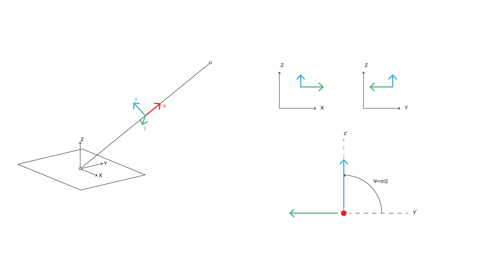

# StiffnessTransformationMatrices
Premade local stiffness matrices, $k$, and transformation matrices $R$ in Julia for the following members/releases:

- 2D truss
- 2D frame
  - Fixed-Fixed
  - Hinge-Fixed
  - Fixed-Hinge
  - Hinge-Hinge
- 3D truss
- 3D frame
  - Fixed-Fixed
  - Hinge-Fixed
  - Fixed-Hinge
  - Hinge-Hinge

The stiffness matrix in global coordinates can be found by: $K_e = R^Tk_eR$.

Matrices are directly from Aslam Kassimali's *Matrix Analysis of Structures* 2e, with one exception (see below).

Two methods are provided for each transformation matrix:

```julia
R(Cx, Cy, Cz) = ...
R(posStart, posEnd, L) = ...
```

The first method directly takes the directional cosines of the element in question, IE the normalized x/y/z coordinates of the vector representation of the element.

The second method calculates these cosines for you given a starting point, ending point, and length.

## Some notes
### Member releases/fixed-end forces
Member released stiffness matrices are provided for 2D and 3D trusses, but associated fixed-end force vectors are not. Only nodal loads will work when these matrices are directly applied to FEA.

### Local coordinate system for 3D frames
The transformation matrix for 3D frames uses the *pitch angle* approach, which determines the rotation of the local coordinate system about the local X axis. For reasons unknown to me, Kassimali (and others) take the XZ plane as the ground plane for matrix formulations; this causes headaches when trying to interface with common CAD programs where the XY plane is generally taken as the ground.

The pitch angle method sets a default orientation of the local coordinate system such that the local Y axis is parallel to the global XY plane, IE local Y has no component in the Global Z direction. This means that the local strong axis is not being used for loads applied in the global Z direction (e.g., gravity).

To resolve this, a default pitch angle $\Psi = \pi/2$ is provided for all 3D frame transformation matrices to ensure that the local strong axis is always active for gravity loading. See figure below.

